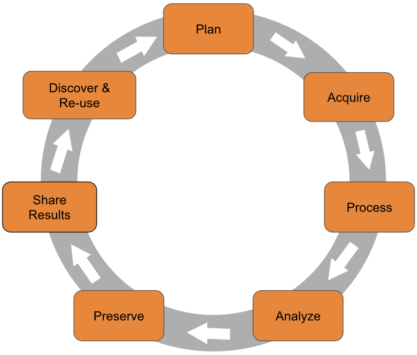

Session 1
================
Dominic Bordelon, Research Data Librarian, University of Pittsburgh
Library System
June 14, 2022

# Session 1: **RStudio orientation and R basics**

Welcome!

## Agenda

1.  About the trainer
2.  What are R and RStudio? What can you do with them?
3.  RStudio Orientation
4.  Packages: what they are and installing them
5.  Import a spreadsheet as an R data frame
6.  Common data structures in R (data frames, vectors, lists)
7.  Objects and functions
8.  Next steps

## About the trainer

**Dominic Bordelon**, Research Data Librarian  
University Library System – Digital Scholarship Services  
<dbordelon@pitt.edu>, <https://pitt.libguides.com/dominicbordelon>

Previously: background in humanities and libraries + self-taught coding
interest ➝ library IT and web development (\~5 yrs) ➝ Research Data
Librarian at Pitt since Nov 2019

Support for various “data work”…

-   data management planning (esp. for grant proposals)
-   data cleaning, processing, analysis, visualization using tools like
    R and Python
-   project version control using Git and GitHub
-   understanding IT terms, how the internet works (HTTP, APIs), etc.,
    as it pertains to your research
-   data sharing and other Open Science topics

…via consultations ([book
here](https://pitt.libcal.com/appointments/research_data_librarian));
workshops for the Pitt community; on-request training

[Carpentries](https://carpentries.org/)[^1] Certified Instructor

Returning part-time undergrad in Ecology

## What are R and RStudio?


**R** is…

-   a tool for data analysis and visualization, especially in
    statistical and research contexts
-   a programming language[^2]
-   text-based command interface
    
    it runs on the console/command line
-   biased towards tabular data and matrices (in practice)
-   free, open-source software (FOSS) stewarded by the nonprofit,
    Vienna-based R Foundation
-   full name: The R Project for Statistical Computing


**RStudio (Desktop)** is…

-   an “integrated development environment” for analysis and programming
    in R and Python
-   a graphical layer of software to facilitate our usage of R
-   Posit (until recently, called RStudio) is a Boston-based company,
    founded 2009, which makes both FOSS and commercial software[^3] and
    offers hosted services

### What can you do with R and RStudio?

Let’s follow the research data life cycle…

<figure>

<figcaption aria-hidden="true">Research Data Lifecycle; source: <a
href="https://researchdata.princeton.edu/research-lifecycle-guide/research-lifecycle-guide">Princeton
Research Data Service</a></figcaption>
</figure>

#### Data collection from online sources

-   API == Application Programming Interface
    -   Many open data sources are accessible programmatically via HTTP
        APIs
    -   You can dynamically query the remote database and get the
        matching data back in a structured way, as opposed to needing to
        download many files.
    -   Some examples: Google Maps, Twitter, Fitbit, Census Reporter,
        COVID-19 Data Portal, NCI Genomic Data Commons
    -   Package: [httr](https://httr.r-lib.org/)
-   Web scraping
    -   Extracting information from web page HTML

    -   Package: [rvest](https://rvest.tidyverse.org/)

#### Data cleaning, processing, and reshaping

For example:

-   standardizing mixed column names, removing extra white space from
    cells
-   splitting and combining columns
-   detecting and handling missing values and outliers
-   reshaping tabular data


Packages: [dplyr](https://dplyr.tidyverse.org/),
[tidyr](https://tidyr.tidyverse.org/)

#### Combining data from different sources

Table joins

Connect to databases

Packages: [dplyr](https://dplyr.tidyverse.org/),
[dbplyr](https://dbplyr.tidyverse.org/)

#### Types of data analysis and visualization

Statistical analysis (frequentist and Bayesian)

Machine Learning (e.g., TensorFlow)

Geocomputation, GIS:

-   Mapping (raster and vector)
-   Analysis and statistical modeling

Computational text analysis

Computational genomics:

-   working with genomic intervals
-   high-throughput RNA-seq and ChIP-seq analysis
-   DNA methylation analysis

High-performance computing (e.g., Hadoop)

#### Documents, slideshows, websites, books

-   [Literate
    programming](https://en.wikipedia.org/wiki/Literate_programming):
    mix narrative text, code, code outputs (e.g., viz or tables)
-   Hypertext: include images, links, embedded video, footnotes
-   Use
    
    (esp. for math formulas)
    -   Inline mode example:[^4]
        

    -   Display mode example:[^5]

^n + 1}")

-   Make inline citations and bibliography using Zotero and/or .bib
    files
-   One input file, many potential output formats (PDF, HTML, Word…)
-   Presentations can be PPTX, PDF, or browser-based ([demo
    here](https://quarto.org/docs/presentations/revealjs/demo/))
-   For many more examples check out the [RMarkdown
    gallery](https://rmarkdown.rstudio.com/gallery.html) or the [Quarto
    gallery](https://quarto.org/docs/gallery/)

#### Dashboards and other web apps

-   “Dashboard”: in-browser interface with viz of live, refreshing data
    (e.g., from a database), often with some interactivity, like
    filtering, drilling down, highlighting based on mouse cursor, etc.
-   Packages: [Shiny](https://shiny.rstudio.com/),
    [plotly](https://plotly.com/r/)
-   For lots of examples, check out the [Shiny
    Gallery](https://shiny.rstudio.com/gallery/)

## RStudio Orientation

### Panes

-   Bottom left: Console
    -   Run commands instantly in R
        
        see command-line output
    -   Command history (press up arrow key)
-   Top left: Source/Editor
    -   Where you open files (tabbed)
    -   Write a script (multiple lines of R code), which you can *Run* (
        = RStudio sends each line of the script to the console pane)
    -   Can also be used to write documents in plain text or markdown,
        or *notebooks* in RMarkdown
-   Top right: Environment, History
    -   Global Environment = workspace of your current R session
-   Bottom right: Help, Working Directory

### RMarkdown/Quarto

-   This document is written in Quarto format, which is the most recent
    iteration of RMarkdown. A file written in RMarkdown is also called
    *an RMarkdown Notebook* or just *an R Notebook*.
-   Extends the popular
    [markdown](https://daringfireball.net/projects/markdown/) format
    (seen on Wikipedia and GitHub) by enabling the author to include
    executable code *chunks* like the one below
-   Switch between Source and Visual editors (buttons near top left of
    editor pane)

A code chunk:

### Configuration

-   Tools \> Global Options…
-   Many options can also be configured at project level
-   Keyboard shortcuts are very handy! Tools \> Keyboard Shortcuts Help

### Files and file types

-   [**R
    Projects**](https://support.rstudio.com/hc/en-us/articles/200526207-Using-RStudio-Projects)
    (.Rproj) are the suggested way of organizing your work in RStudio.
    Benefits include dedicated [command
    history](https://support.rstudio.com/hc/en-us/articles/200526217-Command-History-in-the-RStudio-IDE)
    and settings.
-   **R Notebooks** or RMarkdown documents (.Rmd) intermix R code and
    text formatted with markdown; the newest version are **Quarto
    documents** (.qmd)
-   **R scripts** (.R) are plain-text files that can be executed by R
    directly. However, because the file must be parseable, this means
    that the only permitted “natural language” is in code comments.

## 📦 Packages: what they are and installing them

In addition to R’s built-in functionality (“base R”), we can also
leverage work done by the community, released as **packages**. The
developer of a package loads it onto a public repository **CRAN** (the
Comprehensive R Archive Network). From CRAN, R users can install the
package onto their own computer.

Packages are typically built for a specific purpose or to collect a
specific set of functions. Here are some popular examples:

-   ggplot2: makes plots (using a “grammar of graphics”)
-   dplyr: filters, sorts, and modifies datasets
-   shiny: creates web applications, especially dashboards
-   stringr: has tools to help you work with character strings (text)
-   tmap: creates maps

### To install a package

-   Using your mouse:
    -   in the bottom right pane, click the Packages tab
    -   click the Install button at the top of the pane
    -   type the name of the package you want to install (example:
        `stringr`)
    -   click Install
-   Running code: `install.packages("stringr")` (replace `stringr` with
    the name of your desired package)

### To use a package

Once installed, a package needs to be activated before you can use it.

-   Using your mouse:
    -   in the bottom right pane, click the Packages tab
    -   find the name of the package you want to activate (by scrolling
        or searching in the top-right box), example: `stringr`
    -   click the check-box next to the package name
-   Running code: `library(stringr)`

You will need to reactivate the package every time you start a new R
session.

### Let’s install and attach (activate) tidyverse

“tidyverse” is a popular collection of packages–and we’re about to use
it in the next section, so let’s install and activate:

``` r
install.packages("tidyverse")
install.packages("readxl")
library(readxl)
```

## Import a spreadsheet as an R data frame

Easiest is the Import Dataset feature in the Environment pane (top
right).

The Import Dataset feature generates code, which you can paste into a
code chunk, like the one below:

``` r
tg <- read_excel("data/tumorgrowth.xlsx", 
           sheet = "AnalysisData")
```

This way, the file-loading step will be saved in your document, so that
you can easily recreate your session.

## Common data structures in R

### Data frames

A **data frame** is structured in rows (“observations”) and columns
(“variables”). This can also be called tabular data. Our spreadsheet
above is imported as a data frame.

Let’s use the `View()` and `str()` functions to examine the data frame:

``` r
View(tg)

str(tg)
```

You can refer to one variable (column) in a data frame with the **`$`**
(dollar sign):

``` r
tg$Size
```

Data frames are the most typical structure we’ll encounter.

### Vectors

On a more basic level than a data frame, a **vector** is R’s way to
handle multiple items. We create a vector using the `c()` function. For
example, suppose I observe the measurements `41.8`, `85.0`, and `114.0`:

``` r
c(41.8, 85.0, 114.0)

# we can write comments with the pound sign;
# these are ignored by R

# to save a vector as an object:
size <- c(41.8, 85.0, 114.0)
```

Vectors are designed to work efficiently with many repetitive or setwise
operations, for example, applying a mathematical operator or function to
every item in a vector. We also say these functions/operations are
**vectorized**.

``` r
size * 2
sqrt(size)
```

A limitation of vectors is that every item must be of the same data type
(e.g., character or numeric). But they’re sort of R’s default data
structure. They’re also the foundation of data frames: each column is
actually a vector, which means we’ll be working with them a lot.

### Exercise 1

A handy function is `help()`, which queries R’s documentation system.
Most commonly, you’ll look up functions. You can search by running
`help(topic)` or `?topic`, e.g., `?sqrt`. Notice that the result will
appear in the Help pane.

1.  There is confusion among some R users what the “c” in the function
    `c()` stands for. Using the help system, what does `c()` do? What do
    you think “c” stands for?

<!-- -->

2.  Create a vector of arbitrary patient ages and store it as an object
    called `ages`.

<!-- -->

3.  What do you estimate is the mean age? Calculate it using `mean()`.

<!-- -->

4.  What is the mean value of the `Size` variable in `tg`? How about
    `numAge` in `cvdr`?

### Matrices

Vectors are one-dimensional. For 2+ dimensions, we need a **matrix**. We
won’t use them very much in this course, but they are available for you
to investigate further.

``` r
1:9     # the integer sequence 1 to 9, as a vector

matrix(data = 1:9, nrow = 3, ncol = 3)
```

### Lists

Lists are collections of items; unlike vectors, they are potentially
heterogeneous. You can also give a name to each item in a list if
desired. Many specialized data structures are actually lists with
special attributes and functionality.

``` r
list(sex = c("F", "M"),
     group = c("Control", "1", "2", "3"),
     "cm",
     25:35)
```

### Factors

A **factor** is a vector which represents a categorical variable, i.e.,
that there are only a finite number of possible values. Examples of
categorical variables:

-   type of thing
-   which treatment group (or control group)
-   which observation site (e.g., “Plot A”—but not geographic
    coordinates)
-   biological sex (although note that \>2 categories may be coded)
-   gender (although note that a binary is not necessarily presumed)
-   month, day of week, week number of year
-   shoe size, athletic weight class (but not: height, weight)
-   Likert scale (e.g., “on a scale of 1 to 5, where 1 is strongly
    disaree and 5 is strongly agree…”)

The possible values of a factor are its **levels**. Levels may be
**ordered** (e.g., month) or unordered (e.g., sex, eye color).

To create a factor, use the `factor()` function. R will automatically
determine the levels, but you can specify them, as well as whether they
are ordered.

``` r
factor(c("Control", "Group 1", "Group 2"))
```

Sometimes your dataset might have categorical data coded numerically
(e.g., `1` for females and `2` for males), such that you will also want
to have a way to store human-readable **labels**.

``` r
factor(c(1, 2, 1, 3, 1, 2, 1, 2, 2, 3, 2, 1, 2, 3, 1, 1),
       levels = c("1", "2", "3"),
       labels = c("Control", "Group 1", "Group 2"))
```

## Objects and functions

When we give R a command, it usually returns an **object** of some kind.
We can usually see a representation of this object in the console when R
returns the object.

To store the object in memory, in order to view it more than once or
modify it, we will need to assign a name to the object. *(Note: saving
to memory ≠ saving to disk!)* We’ll use the **assignment operator**,
written **`<-`**, between our new object’s name and the function call.
For example:

``` r
c(41.8, 85.0, 114.0)      # creates a vector with three values

size <- c(41.8, 85.0, 114.0)      # creates the vector and saves it to an object called "size"

# note the "size" object in your Environment tab!
size
```

### Data types

On object’s data type determines what kinds of operations we can do on
the object. For example, numeric and character vectors have different
behaviors:

``` r
group <- c("Group 1", "Group 2", "Group 1", "Group 1")

size * 2
group * 2   # error!
```

To find out an object’s data type, you can see it listed in the
Environment tab (`chr`, `num`) or run the `typeof()` function.

### Functions

A function can have one or more **arguments**; for example, the `sqrt()`
function takes an `x` argument, which we could also write as `sqrt(x)`.
In the code chunk below, we use the `size` object for the `x` argument:

``` r
sqrt(size)

# R also supports "named arguments":
sqrt(x = size)
```

We say that a function **returns** its output (often an object);
`sqrt(16)` returns `4`.

You can also write your own functions, using **`function()`**. Here is a
function that raises `x` to the `y` power:

``` r
my_new_function <- function(x, y) {
  return(x^y)
}

my_new_function(2, 3)     #   == 2^3
```

### An Example Plot

``` r
library(palmerpenguins)
data(penguins)
penguins %>% 
  ggplot(mapping=aes(x=body_mass_g, y=bill_length_mm)) +
  geom_point() +
  geom_smooth()
```

### Exercise 2

1.  Consider:

``` r
my_seq <- c(1, 2, 3)
my_seq <- c(my_seq, 4, 5)    # predict my_seq's value

my_seq <- c(my_seq, 6, c(7, 8))    # and here?
```

2.  Consider the factor in the code chunk below. Does `bases` have the
    value you expect? If not: what do you think is going on here?

``` r
bases <- factor(c("A", "C", "G", "A", "T", "G", "U", "C"), 
                levels=c("A", "C", "G", "T"))

bases
```

## Next Steps

Today we learned about:

-   R and RStudio orientation
-   Importing spreadsheets
-   Data structures: data frames, vectors, matrices, lists, factors
-   Object and functions

Upcoming events:


-   R & RStudio Drop-In Hour (weekly, Tuesdays, 5–6pm)
-   Workshops in data wrangling and data visualization:
    <http://pi.tt/ds-workshops>

Keep learning on your own:

-   Check out the free ebook R for Data Science, or the Big Book of R
-   LinkedIn Learning is a Pitt-subscribed resource

[^1]: The Carpentries is a community which “builds global capacity in
    essential data and computational skills for conducting efficient,
    open, and reproducible research” through evidence-based instructor
    and mentor training and open learning materials
    ([link](https://carpentries.org/about/)). It is fiscally sponsored
    by Community Initiatives, a CA-based 501(c)(3) nonprofit.

[^2]: Programming language style: practical R usage tends to operate in
    the procedural and functional programming paradigms, rather than an
    object-oriented paradigm.

[^3]: FOSS products: RStudio Desktop, RStudio Server, Shiny Server, and
    many R packages. Commercial products: RStudio Team, RStudio
    Workbench.

[^4]: Shannon Diversity Index,
    https://en.wikipedia.org/wiki/Diversity_index#Shannon_index

[^5]: the Hill equation,
    <https://en.wikipedia.org/wiki/Hill_equation_(biochemistry)>
