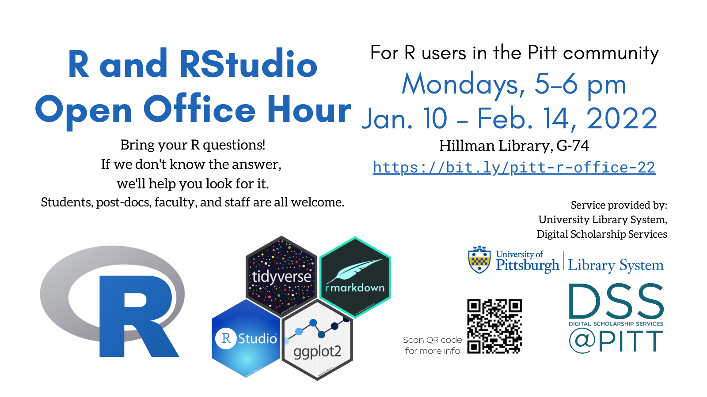

## Notes on presentation format

-   Feel free to follow along on your own computer, or simply watch

    -   This notebook (including code) will be shared!

-   Due to time constraints, this is more of a *guided tour* than a *lesson* in R

    -   Less time for practice/synthesis, but greater number of topics covered

-   

## What is R? What is RStudio?

[**R**](https://www.r-project.org/) is:

-   an application

    -   a statistical analysis and visualization software package
    -   a command-line executable
    -   in version 4.1.2 (12/2021)

-   a programming language

-   multi-platform, free, open-source

[**RStudio**](https://www.rstudio.com/) is:

-   an integrated development environment (IDE) with graphical interface for R and related tools

    -   in version 2021.09 (12/2021)

-   a public benefit corporation that develops software (>50% free and open source) and provides related services

You need R installed in order to use RStudio. They work together, but are separate applications.

------------------------------------------------------------------------

## RStudio orientation

### Panes

-   Bottom left: Console

    -   Run commands instantly in R $\rightarrow$ see command-line output

-   Top left: Editor

    -   Where you open files (tabbed); syntax highlighting
    -   Write a script (multiple lines of R code), which you can *Run* ( = RStudio sends each line of the script to the console pane)
    -   Can also be used to write documents (*notebooks*) in the RMarkdown format

-   Top right: Environment

    -   Session information

-   Bottom right: Working Directory

### RMarkdown

-   This document is written in RMarkdown!
-   Extends the popular Markdown format (seen on Wikipedia and GitHub) by enabling the author to include executable code *chunks* as well as $\LaTeX$ expressions (e.g., $H = -\sum^{S}_{i=1} p_i \ln p_i$)
-   So RMarkdown can be used to write reports or preprint manuscripts, combining narrative text with data analysis and visualization!
-   Output types: document (HTML, Word, PDF); slides (HTML, PDF)

### Configuration

-   Tools > Global Options...

    -   Suggestion: General > Workspace > uncheck the .RData option and set the .RData dropdown to Never

-   Many options can also be configured at project level

------------------------------------------------------------------------

## Some things you can do with R

### Basics: variables, functions, data structures

R uses **variables** to store and work with values:

```{r}
length <- 12
width <- 8

length * width
```

If we wanted to save this value, we would create a third variable called area:

```{r}
area <- length * width
area
```

Mathematical operators and **functions** provide the basic ways of working with variables. Each function has a *signature* dictating which *arguments* (parameters) it accepts. For example, the `sqrt()` function, which calculates the square root of an integer, accepts (and requires) one argument, `x`:

```{r}
# will produce an error; remove # to try it:
#sqrt()

sqrt(x=16)
# may also be written as:
sqrt(16)

sqrt((2+1)^2)
area <- 99
sqrt(area)
```

You can store more than one value in a variable by using a data structure such as a **vector**, matrix, or **data frame**. Itemwise operations/functions can work on vectors.

```{r}
# vectors are created with the c() function
my_vector <- c(13, 11.2, 6^2, 4.31e2, 0, -7)
my_vector

# add 100 to each item in the vector:
my_vector + 100

# some functions operate on the data structure in aggregate, not just itemwise:
min(my_vector)
mean(my_vector)
median(my_vector)
sd(my_vector)
max(my_vector)
```

A data frame is like a table or spreadsheet. Each column of information is a vector. The example below uses a built-in dataset called mtcars.

```{r}
head(mtcars)

# to reference a named column, use a $:
mtcars$mpg
```

R's core functionality can be extended with many community-authored **packages**. Once a package is installed, you can use its code in your current environment with the library() function. (Most packages are useful, but the example below is just for fun.)

```{r}
library(cowsay)

```

### Clean up and transform data

### Generate statistical models

### Visualize data

### Use R Notebooks for reproducible preprints and visually appealing reports

### Program in R

------------------------------------------------------------------------

## Where to go next

Here are some ways you can continue learning:

-   [R for Data Science](https://r4ds.had.co.nz/), a free online book by community leader Hadley Wickham
-   [LinkedIn Learning](https://www.technology.pitt.edu/services/ondemand-training-linkedin-learning) offered via Pitt IT has video courses
-   [PittCat ebooks](https://pitt.primo.exlibrisgroup.com/discovery/search?query=any,contains,r%20statistics&tab=Everything&search_scope=MyInst_and_CI&vid=01PITT_INST:01PITT_INST&lang=en&offset=0), access to thousands of online tech books
-   [exercism R track](https://exercism.org/tracks/r), a platform for learning to code
-   Pitt students: STAT 1621 Principles of Data Science
-   We offer training for groups (labs, collaborations, etc.)

### Where to get answers

Here are resources for solving specific questions/problems you have in R:

-   Weekly Open Office Hour: Mondays 5--6pm (this semester, subject to change; check [library.pitt.edu](https://library.pitt.edu/))
-   Pitt ULS [AskUs](https://library.pitt.edu/ask-us): email responses for simple questions and/or book an appointment for in-person or Zoom help
-   [StackOverflow (questions tagged R)](https://stackoverflow.com/questions/tagged/r)
-   [/r/rstats community on reddit](https://www.reddit.com/r/rstats/)
-   [RStudio Community](https://community.rstudio.com/) (forums)

[](https://bit.ly/pitt-r-22)
