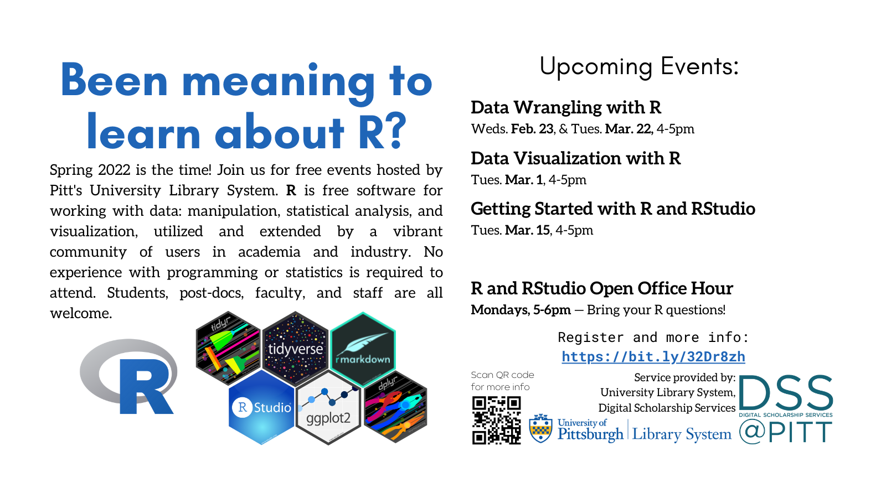
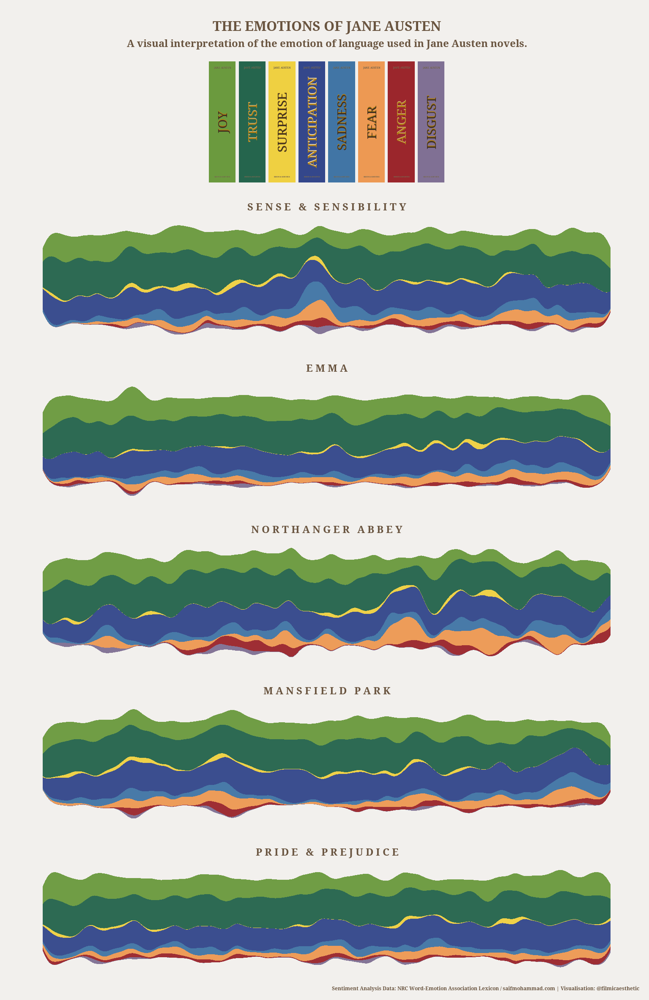
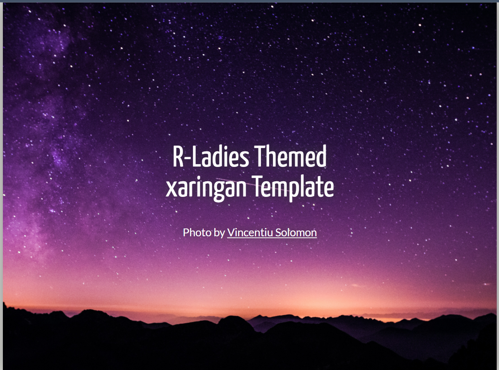
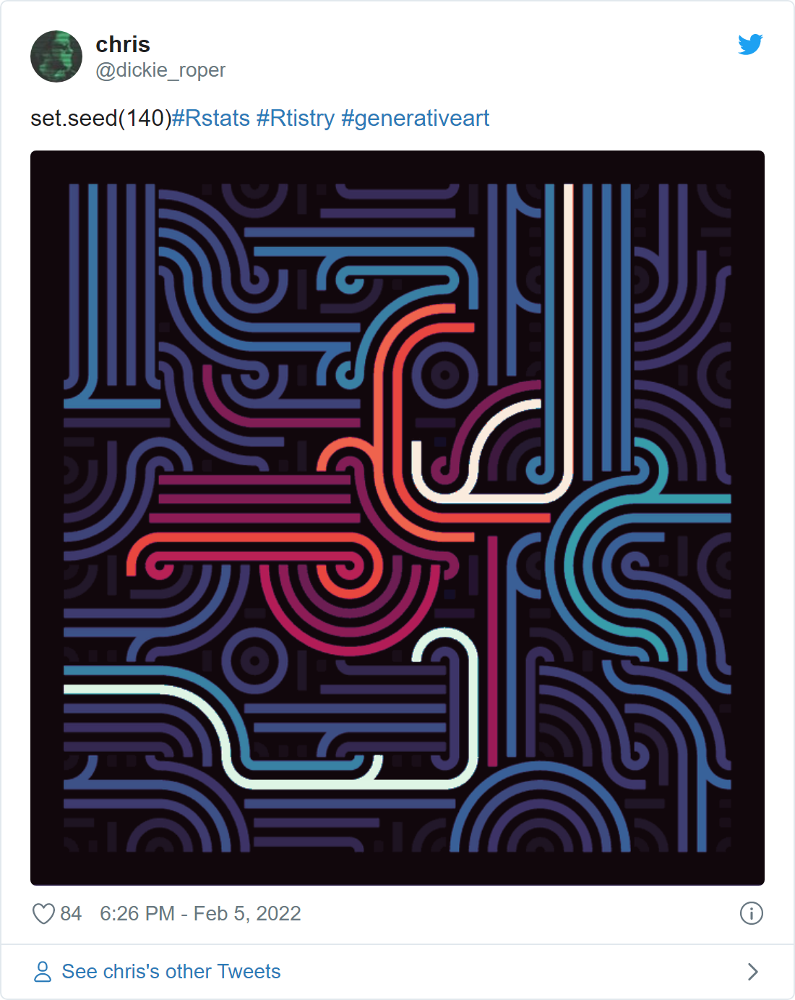
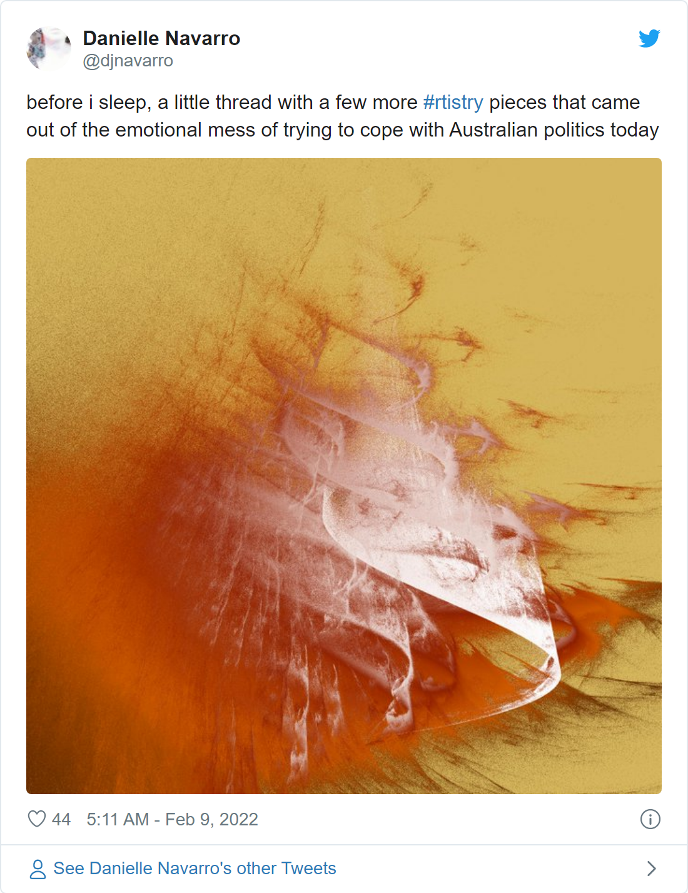

```{r setup}
library(tidyverse)
```

## Agenda

1.  What are R and RStudio? What can you do with them?
2.  RStudio orientation
3.  Examining a dataset
4.  Plotting
5.  Where to go next; where to get answers

## Introductory stuff

### About the presenter

-   Dominic Bordelon, Research Data Librarian, University Library System at Pitt

-   Previous experience:

    -   humanities undergrad (History, Spanish, English (Writing & Culture)), MLIS
    -   web programmer in library settings 2014-2019

### The Library's Digital Scholarship Services

<https://pi.tt/dss>

### Upcoming Events!

[](https://lovedatapgh.io/)



### License

[{width="91"}](https://creativecommons.org/licenses/by/4.0/ "CC BY license")\
"Getting Started in R and RStudio" by Dominic Bordelon is licensed for reuse under a Creative Commons Attribution (CC BY) 4.0 International license (<https://creativecommons.org/licenses/by/4.0/>).

------------------------------------------------------------------------

## What are R and RStudio?

[**R**](https://www.r-project.org/) is:

-   an **application** for **working with quantitative data**

-   a **programming language** (for extending functionality and/or creating web applications)

-   multi-platform, free, open-source

-   known formally as "[The R Project for Statistical Computing](https://www.r-project.org/about.html)," managed by [the R Foundation](https://www.r-project.org/foundation/)

[**RStudio**](https://www.rstudio.com/) is an **integrated development environment (IDE)** with graphical interface for R, with some related tools.

You need R installed in order to use RStudio. They work together, but are separate applications.

## What can you do with R?

### Data manipulation and cleaning

Identifying and handling missing values and outliers

Getting data to a "tidy" state (one observation per row, one variable per column)

Combining relational data

### Exploratory data analysis

Quick summary statistics and plots

### Statistical modeling

](images/poisson.png)

](images/logistic.png)

### Publication-ready, highly customizable visualization

#### Small multiples

```{r}
# cylinder classes plotted together:
mtcars
ggplot( mtcars , aes(x=mpg, y=wt, color=as.factor(cyl) )) + 
  geom_point(size=3) +  
  theme(legend.position="none")

# each cylinder class on its own plot:
ggplot( mtcars , aes(x=mpg, y=wt, color=as.factor(cyl) )) + 
  geom_point(size=3) +  
  facet_wrap(~cyl) +
  theme(legend.position="none")
```

#### Themes

e.g., BBC-style using the `bbplot` package:

](images/bbc.png)

### Specialized kinds of analysis

#### Geospatial

](images/mapview.png)

Work with a variety of projections; create chloropleth maps and a variety of cartograms.

[](images/projection.png){width="500"}](https://plotly-r.com/index.html)

[](images/cartogram.png){width="500"}](https://plotly-r.com/index.html)

#### Text analysis, text mining

An example using sentiment analysis:

[](https://github.com/filmicaesthetic/JaneAustenStreamgraphs)

Machine Learning

Network Analysis

### Authoring documents

Intermix narrative (hyper)text, images, code, and plots!

```{r}
result <- sqrt(16)
```

Can include $\LaTeX$ expressions (e.g., $H = -\sum^{S}_{i=1} p_i \ln p_i$) and HTML

Automate bibliography with a bibtex file

Many output formats with [pandoc](https://pandoc.org/)

### Slides and posters for presentations

Slides load in browser and can be printed to PDF. Example of a slide deck:

{width="300"}

<https://spcanelon.github.io/RLadies-xaringan-template/#1>

### Programming, automation, scripting

Including using web APIs

### Web applications (Shiny)

[Nutrition Calculator](https://yihanw.shinyapps.io/Recipe_Nutrition/)

Many more examples at the [Shiny app gallery](https://shiny.rstudio.com/gallery/)

### Web publishing: sites, online books, blogs

Personal site of Mike Mahoney (PhD candidate, SUNY-ESF): <https://www.mm218.dev/>

Faylab Lab Manual: <https://thefaylab.github.io/lab-manual/>

### Generative art

{width="500"}

{width="500"}

[#Rtistry on twitter](https://twitter.com/hashtag/rtistry)

------------------------------------------------------------------------

## RStudio orientation

### Panes

-   Bottom left: Console

    -   Run commands instantly in R $\rightarrow$ see command-line output
    -   Tab code completion; command history

-   Top left: Source/Editor

    -   Where you open files (tabbed); syntax highlighting
    -   Write a script (multiple lines of R code), which you can *Run* ( = RStudio sends each line of the script to the console pane)
    -   Can also be used to write documents in plain text or markdown, or *notebooks* in RMarkdown

-   Top right: Environment, History

    -   Environment = workspace of your current R session

-   Bottom right: Help, Working Directory

### RMarkdown

-   This document is written in RMarkdown! Also called *an RMarkdown Notebook* or just *an R Notebook*.
-   Extends the popular [markdown](https://daringfireball.net/projects/markdown/) format (seen on Wikipedia and GitHub) by enabling the author to include executable code *chunks*
-   Switch between graphical and source editors

### Configuration

-   Tools > Global Options...

-   Many options can also be configured at project level

-   Keyboard shortcuts are very handy! Tools > Keyboard Shortcuts Help

### Files and file types

-   [**R Projects**](https://support.rstudio.com/hc/en-us/articles/200526207-Using-RStudio-Projects) (.Rproj) are the suggested way of organizing your work in RStudio. Benefits include dedicated [command history](https://support.rstudio.com/hc/en-us/articles/200526217-Command-History-in-the-RStudio-IDE) and settings.
-   **R Notebooks** or RMarkdown documents (.Rmd) intermix R code and text formatted with markdown
-   **R scripts** (.R) are plain-text files that can be executed by R directly. However, because the file must be parseable, this means that the only permitted "natural language" is in code comments.

------------------------------------------------------------------------

## Our first steps in R

We're going to examine and visualize the `storms` dataset, a dataset included with the `dplyr` package, which describes several decades of hurricanes.

R uses **objects** to store and work with values. Numeric objects as well as raw values can interact via mathematical operators. The **assignment operator**, written as **`<-`**, stores a value in an object.

Beyond mathematical operators, **functions** provide the basic ways of working with objects. Each function has a *signature* dictating which *arguments* (parameters) it accepts.

*Directly below is our first **code chunk***. *You can insert one anywhere in an R Notebook. Whatever you type inside it has to be valid R code, although comments can be preceded with `#`. You can execute an individual line or the whole chunk.*

```{r}
library(tidyverse)
# math:
1+2^2
# functions:
sqrt(16)
# objects:
result <- sqrt(36)
result = sqrt(36)
print(result)
print(paste("The time is", Sys.time()))
```

------------------------------------------------------------------------

## Examining a dataset

Must-know functions:

-   `summary()`
-   `str()`
-   `glimpse()`
-   `View()`

```{r}
storms  # preview the data
?storms  # (because this is a builtin, there is help documentation)
str(storms)  # view STRucture of storms (works on many objects)
glimpse(storms, width=70)  # another type of preview
View(storms)  # open a view on the data, which you can explore
# clicking on a dataset in the Environment pane does the same

storms <- storms  # ran this to get storms listed in my Environment pane
# when you open a CSV (or TSV or xlsx, etc.),
# the dataset will appear in Environment.

summary(storms) # run this to get a summary all the columns
summary(storms$wind) # a summary of just one column
```

------------------------------------------------------------------------

## Plotting

```{r}
plot <- ggplot(data=storms)
ggplot(storms)
sqrt(16)
sqrt(x=16)

plot + geom_histogram(mapping=aes(x=year), binwidth = 1)
plot + geom_freqpoly(mapping=aes(x=month))
plot + geom_histogram(mapping=aes(x=pressure))
plot + geom_bar(mapping=aes(x=category))
plot + geom_bar(mapping=aes(x=status))

plot + geom_point(mapping=aes(x=pressure, y=wind))
# ^ not a good plot!
# 1. very many points (11k), data should probably be further summarized/aggregated
# 2. there is likely to be some overplotting, i.e. points of equivalent position stacked atop one another, making the distribution more difficult to discern.

plot + geom_boxplot(mapping=aes(x=as.factor(month), y=pressure))
plot + geom_violin(mapping=aes(x=as.factor(month), y=pressure))
plot + geom_boxplot(mapping=aes(x=as.factor(month), y=wind))

# check out the ggplot cheat sheet (Help menu > Cheat sheets > Data viz with ggplot2) for many more possible chart types!

storms05 <- storms %>% 
  filter(year==2005)

katrina <- storms05 %>% 
  filter(name=="Katrina")
ggplot(katrina) + geom_point(mapping=aes(x=pressure, y=wind))
# ^ better plot (reasonable subset)

# reading a TSV file:
emissions <- read_tsv("sdg_13_10.tsv")
# however, this dataset is not quite ready for use, we would need to do a little work on it, especially with {tidyr}
```

## Where to go next

Here are some ways you can continue learning:

-   Upcoming 1-hour Library workshops for [data wrangling](https://pitt.libcal.com/event/8671368) (2/23), data visualization

-   [R for Data Science](https://r4ds.had.co.nz/), or R4DS, a free online book by Wickham and Grolemund

    -   Anecdotally, R4DS is the most popular resource I see recommended for starting in R, and it has spa
    -   [Dr. Wickham](https://hadley.nz/) (Chief Scientist, RStudio & adjunct prof. of stats at U of Auckland, Stanford, and Rice) is also creator/lead developer of the tidyverse

-   [LinkedIn Learning](https://www.technology.pitt.edu/services/ondemand-training-linkedin-learning), offered via Pitt IT, has video courses

-   [PittCat ebooks](https://pitt.primo.exlibrisgroup.com/discovery/search?query=any,contains,r%20statistics&tab=Everything&search_scope=MyInst_and_CI&vid=01PITT_INST:01PITT_INST&lang=en&offset=0), access to thousands of online tech books

-   [exercism R track](https://exercism.org/tracks/r), a platform for learning to code

-   Or dive into packages and resources specific to your field (see [Big Book of R](https://www.bigbookofr.com/) for ideas)

-   Pitt students: STAT 1621 Principles of Data Science teaches R from scratch (using R4DS) as well as getting you into the basics of data science (i.e., using lots of statistics on big data)

-   We offer training for groups (labs, collaborations, etc.)

### Where to get answers; reference resources

Here are resources for solving specific questions/problems you have in R:

-   Weekly Open Office Hour: Mondays 5--6pm (see flier below)
-   Pitt ULS [AskUs](https://library.pitt.edu/ask-us): email responses for simple questions and/or book an appointment for in-person or Zoom help
-   [StackOverflow (questions tagged R)](https://stackoverflow.com/questions/tagged/r) is a great place for tech questions (search before asking)

Reference resources and ways to connect with the R user community:

-   The [Big Book of R](https://www.bigbookofr.com/) is an annotated bibliography of R resources, especially (e-)books (many of them free).
-   [/r/rstats community on reddit](https://www.reddit.com/r/rstats/)
-   [RStudio Community](https://community.rstudio.com/) (forums)
-   [#rstats](https://twitter.com/hashtag/rstats) on Twitter

[](https://bit.ly/pitt-r-22)
