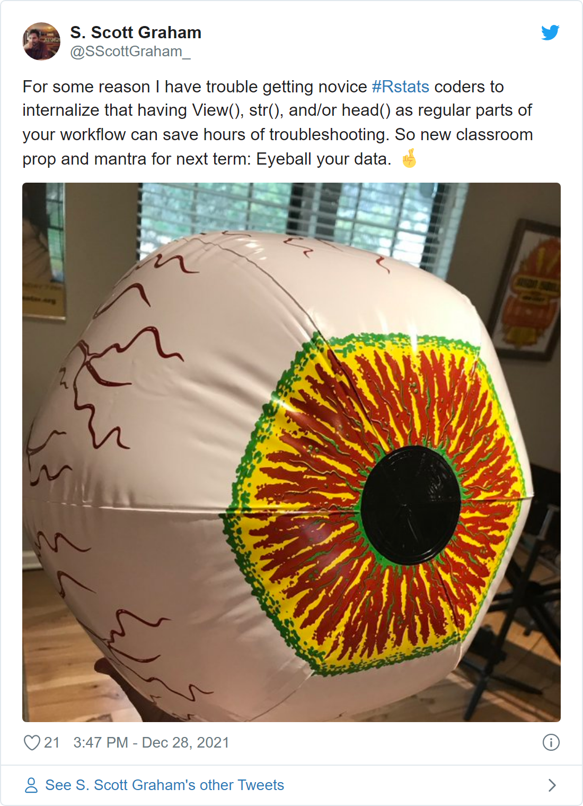

## Agenda

1.  Introductory stuff

2.  What are R and RStudio?; RStudio orientation

3.  Some things you can do in R(Studio)

    1.  Clean up, transform, and analyze data; generate statistical models
    2.  Visualize data for exploration or presentation
    3.  Intermix code, output (plots), and narrative/explanatory text with R Notebooks

4.  Where to go next; where to get answers

## Introductory stuff

### Notes on presentation format

-   Feel free to follow along on your own computer, or simply watch

    -   This notebook (including code) will be shared!

-   Due to time constraints, this is more of a *guided tour* than a *lesson* in R

### About the presenter

-   Dominic Bordelon, Research Data Librarian, University Library System at Pitt

-   Previous experience:

    -   programmer in library settings 2014-2019

------------------------------------------------------------------------

## What is R? What is RStudio?

[**R**](https://www.r-project.org/) is:

-   an **application** for **working with data**

    -   "working with" = viewing, calculating, transforming, analyzing, visualizing
    -   "data" = tabular data is the usual, but there are tools for other kinds of data as well
    -   accessible from the OS command line; commands are issued by typing code
    -   in version 4.1.2 (12/2021)
    -   also available as a server

-   a **programming language** (for extending functionality and/or creating web applications)

    -   the R application is an **interpreter** which understands and acts upon R code
    -   a vibrant community has leveraged this feature to create many free, reusable **packages** (currently \~19k of them)

-   multi-platform, free, open-source

-   known formally as "[The R Project for Statistical Computing](https://www.r-project.org/about.html)," managed by [the R Foundation](https://www.r-project.org/foundation/)

[**RStudio**](https://www.rstudio.com/) is:

-   an **integrated development environment (IDE)** with graphical interface for R, with some related tools

    -   a minimal IDE would be a specialized text editor for writing code + interpreter; RStudio offers much more
    -   in version 2021.09 (12/2021)

-   a public benefit corporation that develops software (>50% free and open source) and provides related services

You need R installed in order to use RStudio. They work together, but are separate applications.

------------------------------------------------------------------------

## RStudio orientation

### Panes

-   Bottom left: Console

    -   Run commands instantly in R $\rightarrow$ see command-line output
    -   Tab code completion; command history

-   Top left: Editor

    -   Where you open files (tabbed); syntax highlighting
    -   Write a script (multiple lines of R code), which you can *Run* ( = RStudio sends each line of the script to the console pane)
    -   Can also be used to write documents in plain text or markdown, or *notebooks* in RMarkdown

-   Top right: Environment, History

    -   Environment = workspace of your current R session

-   Bottom right: Help, Working Directory

### RMarkdown

-   This document is written in RMarkdown!
-   Extends the popular [markdown](https://daringfireball.net/projects/markdown/) format (seen on Wikipedia and GitHub) by enabling the author to include executable code *chunks*
-   Switch between graphical and source editors

### Configuration

-   Tools > Global Options...

    -   Suggestion: General > Workspace > uncheck the .RData option and set the .RData dropdown to Never

-   Many options can also be configured at project level

-   Keyboard shortcuts are very handy! Tools > Keyboard Shortcuts Help

### Files and file types

-   [**R Projects**](https://support.rstudio.com/hc/en-us/articles/200526207-Using-RStudio-Projects) (.Rproj) are the suggested way of organizing your work in RStudio. Benefits include dedicated [command history](https://support.rstudio.com/hc/en-us/articles/200526217-Command-History-in-the-RStudio-IDE) and settings.
-   **R Notebooks** or RMarkdown documents (.Rmd) intermix R code and text formatted with markdown
-   **R scripts** (.R) are plain-text files that can be executed by R directly. However, because the file must be parseable, this means that the only permitted "natural language" is in code comments.

------------------------------------------------------------------------

## Prerequisite R basics: objects, functions, data structures

At its most simple, we can use R as a calculator, with familiar mathematical operators:

*Directly below is our first **code chunk***. *You can insert one anywhere in an R Notebook. Whatever you type inside it has to be valid R code, although comments can be preceded with `#`. You can execute an individual line or the whole chunk.*

```{r}
7 + 2

# here is a comment!
# order of operations (PEMDAS):
2 * ((1 + 2) / (9 - 3))^2
```

R uses **objects** to store and work with values. Numeric objects as well as raw values can interact via mathematical operators. The **assignment operator**, written as **`<-`**, stores a value in an object.

```{r}
# create object `length` and store the value 12 in it:
length <- 10
# typing just the object name tells us the value stored in it:
length

width <- 8

# using objects with mathematical operators and numeric values:
length + 2
(2^2) / width

# calculating area and storing it in a third object:
area <- length * width
area

# assignment happens only once; changing length does not update area unless we reassign it.
length <- 5 # length changes to 5
area # area is still 80
area <- length * width
area # == 40
```

Beyond mathematical operators, **functions** provide the basic ways of working with objects. Each function has a *signature* dictating which *arguments* (parameters) it accepts. For example, the `sqrt()` function, which calculates the square root of an integer, accepts (and requires) one argument, `x`:

```{r}
# next line will produce an error; remove # to try it:
#sqrt()

# we can learn more about the sqrt() function in the Help system:
?sqrt

sqrt(x=16)
# may also be written as:
sqrt(16)

# expressions are evaluated first:
sqrt((2+1)^2)

# using a function on an object:
area <- 99
sqrt(area)
```

For storing multiple values in one object, R has data structures like vectors, matrices, and data frames. Vectors and data frames, described below, are the most common types.

A **vector** is a simple ordered collection, all items being of the same type (e.g., `num`). The **`c()`** ("combine") function creates a vector.

```{r}
my_vector <- c(13, 11.2, 6^2, 4.31e2, 0, -7)
my_vector

length(my_vector) # how many items in the vector?
typeof(my_vector) # what type are they?

# doing math on each item in the vector: ("itemwise")
my_vector + 100
my_vector^2

# some functions operate on the data structure in aggregate, not just itemwise:
min(my_vector)
mean(my_vector)
median(my_vector)
sd(my_vector)
max(my_vector)
```

A **data frame** is like a table or spreadsheet. Each column of information is a vector. Rows are called **observations** and columns are called **variables**. The example below uses a built-in dataset called `mtcars`. The **`head()`**, **`str()`** ("structure"), and **`View()`** functions give us a few ways to examine data frames. (`str()` is valuable for any type of object!)

```{r}
head(mtcars)
str(mtcars)
View(mtcars)

# to reference a named column, use a $:
mtcars$mpg
```

```{r eval=FALSE, include=FALSE}
# code that i used to install the tweetrmd package and fetch the tweet that appears below:
#install.packages("devtools")
#devtools::install_github("gadenbuie/tweetrmd")
library(tweetrmd)
tweet_screenshot(
  tweet_url = "https://twitter.com/SScottGraham_/status/1475931340247810054",
  file = "eyeball.png"
)
```

[{width="400"}](https://twitter.com/SScottGraham_/status/1475931340247810054)

R's core functionality ("**base R**") can be extended with many community-authored **packages**. Once a package is installed, you can use its code in your current environment with the `library()` function. (Most packages are useful, but the example below is just for fun.)

```{r}
install.packages("cowsay")
library(cowsay)

# cowsay gives us a say() function
say()
# what arguments does say() accept? what are the defaults?
```

------------------------------------------------------------------------

## Clean up and transform data

The R community has developed a set of packages called [**the tidyverse**](https://www.tidyverse.org/) to enhance base R's experience for working with data. Using the tidyverse, below, we'll open a CSV file (spreadsheet) and perform a few transformations.

A new syntax convention in the code below is the **pipe**, written as `%>%`. For `functionA() %>% functionB()`, you could read it as, "do functionA then use its output to do functionB."

```{r}
library(tidyverse)

#read_csv
#tibble
#pipe
#pivot?
#missing values
#filter
#mutate

#relational data

#save_csv
```

### Summarize data

We have a dataset we like; now we want to start understanding it. For a variable that interests us, we can apply statistical summary functions like `mean()` and `median()`. We can also use `group_by()` with categorical variables to easily summarize groups within the data.

```{r}
#group by, summarize
```

------------------------------------------------------------------------

## Visualize data

### For exploratory data analysis (EDA)

A next step in examining the data is to plot it. The most popular package for plotting in R is `ggplot2`, which is part of the tidyverse.

```{r}
# examining one variable (histograms, freq plots)
# plotting 2 continuous variables
# plotting continuous vs. categorical variables

```

### Generating and visualizing models

Modelling is an extensive topic. For a quick and simple example, we will simply use `lm()` (part of base R's `stats` package) to fit a linear model.

```{r}
# lm()
# str(lm)
# ggplot + geom_point + geom_abline
```

### For presentation and publication

ggplot provides many facilities for enhancing the plots that you really want to focus on.

```{r}
# labels
# emphasis
# aesthetics
# themes
# saving plots
```

------------------------------------------------------------------------

## Intermix code, output, and narrative text with R Notebooks

-   The approach of mixing computer code with natural-language narrative is called "literate programming" ([Knuth 1992](https://pitt.primo.exlibrisgroup.com/permalink/01PITT_INST/e8h8hp/alma9911528493406236))

-   In addition to code chunks, you can also use $\LaTeX$ expressions (e.g., $H = -\sum^{S}_{i=1} p_i \ln p_i$) and generate your bibliography with a bibtex file

-   Convenience: tweak data, code, and visualizations and see immediate feedback; display/edit all three inline in one application

-   Reproducibility: if you share the data files and the notebook you use for analysis, a peer can easily rerun it

-   Incorporates separate conversion tool [pandoc](https://pandoc.org/) to generate a wealth of [output formats](https://bookdown.org/yihui/rmarkdown/output-formats.html "R Markdown: The Definitive Guide") (HTML notebook, Word doc, Powerpoint, HTML presentation, PDF, latex...)

-   Example papers/projects:

    -   Chaudhry, Suparna, Marc Dotson, and Andrew Heiss. 2021. "Who Cares about Crackdowns? Exploring the Role of Trust in Individual Philanthropy." *Global Policy* 12 (S5): 45--58. <https://doi.org/10.1111/1758-5899.12984>. Analysis notebook: <https://stats.andrewheiss.com/who-cares-about-crackdowns/>

    -   Kadauke, Stephan, Regina M. Myers, Yimei Li, Richard Aplenc, Diane Baniewicz, David M. Barrett, Allison Barz Leahy, et al. 2021. "Risk-Adapted Preemptive Tocilizumab to Prevent Severe Cytokine Release Syndrome After CTL019 for Pediatric B-Cell Acute Lymphoblastic Leukemia: A Prospective Clinical Trial." *Journal of Clinical Oncology* 39 (8): 920--30. <https://doi.org/10.1200/JCO.20.02477>. Reproducibility supplement: <https://skadauke.github.io/early-toci/>

    -   NMFSReports package: [\<https://github.com/EmilyMarkowitz-NOAA/NMFSReports/blob/main/presentations/2021-06-05NMFSReports-RCascadiaConf.pdf>](https://github.com/EmilyMarkowitz-NOAA/NMFSReports/blob/main/presentations/2021-06-05NMFSReports-RCascadiaConf.pdf) (templating for NOAA reports/tech memos, developed by a NOAA fisheries biologist)

    -   Faylab Lab Manual: <https://thefaylab.github.io/lab-manual/> (manual for an ecology lab written in [bookdown](https://bookdown.org/), Rmd for books)

------------------------------------------------------------------------

### Program in R

-   Extracting code as functions follows "the DRY Principle" (Don't Repeat Yourself); easier maintenance
-   Functions are important for modeling
-   Iteration (performing the same action many times)
-   Packages for reusability by yourself and others

```{r}
# writing functions
# loops and maps
```

------------------------------------------------------------------------

## Where to go next

Here are some ways you can continue learning:

-   Upcoming 1-hour workshops for [data visualization](https://pitt.libcal.com/event/8671056) (2/2) and [data wrangling](https://pitt.libcal.com/event/8671368) (2/23)
-   [R for Data Science](https://r4ds.had.co.nz/), a free online book by community leader Hadley Wickham
-   [LinkedIn Learning](https://www.technology.pitt.edu/services/ondemand-training-linkedin-learning), offered via Pitt IT, has video courses
-   [PittCat ebooks](https://pitt.primo.exlibrisgroup.com/discovery/search?query=any,contains,r%20statistics&tab=Everything&search_scope=MyInst_and_CI&vid=01PITT_INST:01PITT_INST&lang=en&offset=0), access to thousands of online tech books
-   [exercism R track](https://exercism.org/tracks/r), a platform for learning to code
-   Or dive into packages and resources specific to your field (see [Big Book of R](https://www.bigbookofr.com/) for ideas)
-   Pitt students: STAT 1621 Principles of Data Science
-   We offer training for groups (labs, collaborations, etc.)

### Where to get answers; reference resources

Here are resources for solving specific questions/problems you have in R:

-   Weekly Open Office Hour: Mondays 5--6pm (see flier below)
-   Pitt ULS [AskUs](https://library.pitt.edu/ask-us): email responses for simple questions and/or book an appointment for in-person or Zoom help
-   [StackOverflow (questions tagged R)](https://stackoverflow.com/questions/tagged/r) is a great place for tech questions (search before asking)

Reference resources and ways to connect with the R user community:

-   The [Big Book of R](https://www.bigbookofr.com/) is an annotated bibliography of R resources, especially \[e\]books (many of them free).
-   [/r/rstats community on reddit](https://www.reddit.com/r/rstats/)
-   [RStudio Community](https://community.rstudio.com/) (forums)
-   [#rstats](https://twitter.com/hashtag/rstats) on Twitter

[](https://bit.ly/pitt-r-22)
