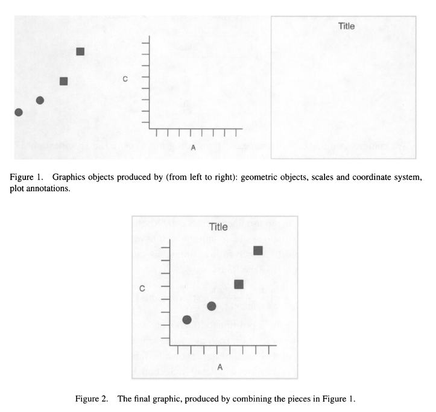

## Agenda

1.  ggplot2 and the grammar of graphics
2.  Exploratory data analysis (EDA)
3.  Styling your plots for presentation or publication
4.  Cool Stuff
5.  Where to go next (Useful Stuff)

## About me and the Library's Digital Scholarship Services

-   Dominic Bordelon, Research Data Librarian

-   Support for "working with data": planning, finding, cleaning, analyzing, visualizing, publishing

    -   code, but also: Data Management Plans (DMPs) for grant proposals; file and data management; writing documentation for code/data

-   Previously

    -   BA English (Writing & Culture), History, Spanish; MLIS, LSU

    -   Self-taught programmer $\rightarrow$ library IT $\rightarrow$ observatory library technology specialist $\rightarrow$ Pitt

Digital Scholarship Services: <https://pi.tt/dss>

## ggplot2 and the grammar of graphics

`ggplot2` is the name of an R package. (A *package* in R terms is "the fundamental unit of shareable code." You can read more about them in the [R Packages book](https://r-pkgs.org/intro.html) by Wickham and Bryan.) ggplot2 is probably the most popular R package and is useful to a broad number of R users. ggplot2 is also part of "[the tidyverse](https://www.tidyverse.org/)," a collection of packages that all work well together because they use shared data structures, they try to make the same assumptions, etc.

1.  To install ggplot2: run `install.packages("ggplot2")` or, in the bottom right pane, click the Packages tab > Install button at left.
2.  To include ggplot2 in your project: run `library(ggplot2)`.
3.  Alternatively, you can install and use tidyverse: `install.packages("tidyverse")` and `library(tidyverse)`. This will take just a little longer when you first run it, but I think the tidyverse is the best way to use R anyway.

ggplot2 is conceptually based in a "layered grammar of graphics" as described in Hadley 2010:



Wickham, Hadley. 2010. "A Layered Grammar of Graphics." Journal of Computational and Graphical Statistics 19 (1): 3--28. <https://doi.org/10.1198/jcgs.2009.07098.>

### The "code template" for a plot

Minimal:

```{ggplot(data = <DATA>) +}
  <GEOM_FUNCTION>(mapping = aes(<MAPPINGS>))
```

`<DATA>` is a dataframe or tibble.

Mappings take the format `aesthetic = variable`, e.g., `x = time_elapsed` (the continuous variable `time_elapsed` is on the x axis) or `color = species` (the categorical variable `species` is indicated using different colors).

More:

```{ggplot(data = <DATA>) +}
  <GEOM_FUNCTION>(mapping = aes(<MAPPINGS>)) +
  <GEOM_FUNCTION>(mapping = aes(<MAPPINGS>), stat=<STAT>, position=<POSITION>) +
  <COORDINATE_FUNCTION> +
  <FACET_FUNCTION> +
  <SCALE_FUNCTION> +
  <THEME_FUNCTION>
```

## Example data sets

**`storms`**: "This data is a subset of the NOAA Atlantic hurricane database best track data, <https://www.nhc.noaa.gov/data/#hurdat.> The data includes the positions and attributes of storms from 1975-2020, measured every six hours during the lifetime of a storm." (See more: `?storms`)

**`diamonds`**: "A dataset containing the prices and other attributes of almost 54,000 diamonds." (See more: `?diamonds`)

## Exploratory data analysis

### Single variable

Histograms (continuous)

```{r}
library(tidyverse)

# frequency of latitude observations:
ggplot(data=storms) +
  geom_histogram(mapping=aes(x=lat))

# set binwidth, using same units as data:
ggplot(data=storms) +
  geom_histogram(mapping=aes(x=lat), binwidth=2.0)
ggplot(data=storms) +
  geom_histogram(mapping=aes(x=lat), binwidth=1.0)
ggplot(data=storms) +
  geom_histogram(mapping=aes(x=lat), binwidth=0.5)

ggplot(data=storms) +
  geom_histogram(mapping=aes(x=long))   # longitude

ggplot(data=storms) +
  geom_histogram(mapping=aes(x=wind), binwidth=5)   # wind
```

Bar charts (discrete)

```{r}
# a count of storm observations in each category (i.e., 1-5 Saffir-Simpson scale)
ggplot(data=storms) +
  geom_bar(mapping=aes(x=category))

# beware that ggplot won't save you from unreasonable plotting:
ggplot(storms) + 
  geom_bar(aes(y=name))

# a more reasonable set to visualize, names of 2005 storms:
storms2005 <- storms %>% filter(year==2005)
ggplot(storms2005) + 
  geom_bar(aes(y=name))
```

You try:

1.  How would you plot a histogram of `pressure` from `storms`?
2.  In the `diamonds` dataset, how would you plot the distribution of `price`? Of `carat` (0.2-5.01)?
3.  In `diamonds`, how would you plot the counts (relative distribution) of `cut` (Fair-Ideal)? Of `color` (D, best, to J, worst)?

```{r}

```

### Two variables

Two continuous variables: scatter plots (`geom_point()`), smooth lines (`geom_smooth()`)

```{r}
# scatter plot of wind and pressure of 2005 storms:
ggplot(data=storms2005) +
  geom_point(mapping=aes(x=wind, y=pressure))

# using transparency for overplotting:
ggplot(data=storms2005) +
  geom_point(mapping=aes(x=wind, y=pressure, alpha=0.1))

# 2d binning:
ggplot(data = storms2005) +
  geom_bin2d(mapping=aes(x=wind, y=pressure))
```

One discrete, one continuous: column charts, box/violin plots

```{r}
# box plot of wind for each category:
ggplot(data=storms) +
  geom_boxplot(mapping=aes(x=category, y=wind))

ggplot(storms) +
  geom_violin(aes(x=category, y=wind))

# pressure distribution for each category:
ggplot(storms) +
  geom_violin(aes(x=category, y=pressure))

ggplot(storms) +
  geom_col(aes(x=year,y=wind),stat="mean")
```

### Using a third aesthetic and variable

```{r}
ggplot(data=storms2005) +
  geom_point(mapping=aes(x=wind, y=pressure), alpha=0.1)

ggplot(data=storms2005) +
  geom_point(mapping=aes(x=wind, y=pressure, color=category), alpha=0.3)
```

You try:

1.  In `diamonds`, scatter plot (`geom_point()`) some continuous variables against one other. Any interesting relationships?
2.  What are the distributions of each diamond `cut` like in terms of `price`?

```{r}

```

## Styling your plots for presentation or publication

### Labels and legends

```{r}
ggplot(data=storms2005) +
  geom_point(mapping=aes(x=wind, y=pressure, color=category), alpha=0.3) +
  labs(x = "Max. Sustained Windspeed (knots)",
       y = "Atmospheric Pressure (mB)",
       category = "Saffir-Simpson Scale")
```

### Themes and color palettes

```{r}
ggplot(data=storms2005) +
  geom_point(mapping=aes(x=wind, y=pressure, color=category), alpha=0.3) +
  theme_minimal()
```

See, e.g., [Themes](https://ggplot2-book.org/polishing.html) in the ggplot2 book, or dive into this massive [Tutorial for Beautiful Plotting in R](https://www.cedricscherer.com/2019/08/05/a-ggplot2-tutorial-for-beautiful-plotting-in-r/).

## Cool Stuff

-   [#TidyTuesday](https://twitter.com/hashtag/TidyTuesday) is a weekly challenge (see [website](https://www.tidytuesday.com/)) for participants to do a bit of analysis and visualization of the same dataset. Great for browsing very current and often creative plots.
-   [#rtistry](https://twitter.com/hashtag/rtistry) (as in "artistry") is the hashtag for generative art in R.
-   Highly polished example of types of research output possible with R Notebooks: <https://stats.andrewheiss.com/who-cares-about-crackdowns/>
-   A lab manual written in bookdown, a package for publishing ebooks from RMarkdown: <https://thefaylab.github.io/lab-manual/>

## Where to go next (Useful Stuff)

Here are some ways you can continue learning:

-   [R for Data Science](https://r4ds.had.co.nz/), a free online book by Hadley Wickham and Garrett Grolemund, a very good all-around
-   or [ggplot2: Elegant Graphics for Data Analysis](https://ggplot2-book.org/) by Wickham
-   or something else from [the Big Book of R](https://www.bigbookofr.com/)
-   [LinkedIn Learning](https://www.technology.pitt.edu/services/ondemand-training-linkedin-learning) offered via Pitt IT has video courses
-   [PittCat ebooks](https://pitt.primo.exlibrisgroup.com/discovery/search?query=any,contains,r%20statistics&tab=Everything&search_scope=MyInst_and_CI&vid=01PITT_INST:01PITT_INST&lang=en&offset=0), access to thousands of online tech books
-   [exercism R track](https://exercism.org/tracks/r), a platform for learning to code
-   Pitt students: STAT 1621 Principles of Data Science
-   We offer training for groups (labs, collaborations, etc.)

### Where to get answers

Here are resources for solving specific questions/problems you have in R:

-   Weekly Open Office Hour: Mondays 5--6pm (this semester, subject to change; check [library.pitt.edu](https://library.pitt.edu/))
-   Pitt ULS [AskUs](https://library.pitt.edu/ask-us): email responses for simple questions and/or book an appointment for in-person or Zoom help
-   [StackOverflow (questions tagged R)](https://stackoverflow.com/questions/tagged/r)
-   [/r/rstats community on reddit](https://www.reddit.com/r/rstats/)
-   [RStudio Community](https://community.rstudio.com/) (forums)
-   [#rstats](https://twitter.com/hashtag/rstats) on twitter

[](https://bit.ly/pitt-r-22)
