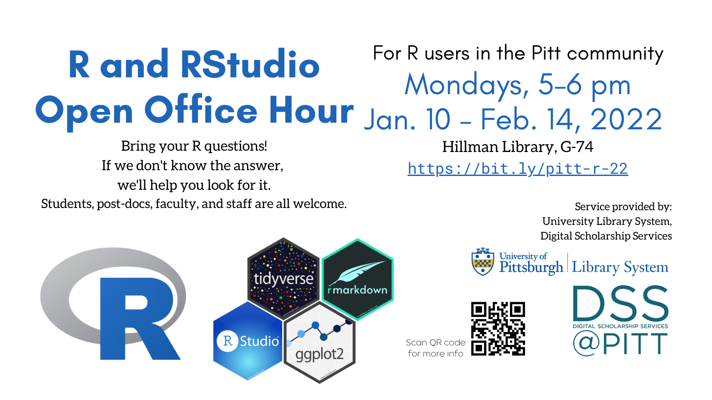

## Notes on presentation format

-   Feel free to follow along on your own computer, or simply watch

    -   This notebook (including code) will be shared!

-   Due to time constraints, this is more of a *guided tour* than a *lesson* in R

    -   Less time for practice/synthesis, but greater number of topics covered

-   

## What is R? What is RStudio?

[**R**](https://www.r-project.org/) is:

-   an application

    -   a statistical analysis and visualization software package
    -   a command-line executable
    -   in version 4.1.2 (12/2021)

-   a programming language

-   multi-platform, free, open-source

[**RStudio**](https://www.rstudio.com/) is:

-   an integrated development environment (IDE) with graphical interface for R and related tools

    -   in version 2021.09 (12/2021)

-   a public benefit corporation that develops software (>50% free and open source) and provides related services

You need R installed in order to use RStudio. They work together, but are separate applications.

------------------------------------------------------------------------

------------------------------------------------------------------------

## Where to go next

Here are some ways you can continue learning:

-   [R for Data Science](https://r4ds.had.co.nz/), a free online book by community leader Hadley Wickham
-   [LinkedIn Learning](https://www.technology.pitt.edu/services/ondemand-training-linkedin-learning) offered via Pitt IT has video courses
-   [PittCat ebooks](https://pitt.primo.exlibrisgroup.com/discovery/search?query=any,contains,r%20statistics&tab=Everything&search_scope=MyInst_and_CI&vid=01PITT_INST:01PITT_INST&lang=en&offset=0), access to thousands of online tech books
-   [exercism R track](https://exercism.org/tracks/r), a platform for learning to code
-   Pitt students: STAT 1621 Principles of Data Science
-   We offer training for groups (labs, collaborations, etc.)

### Where to get answers

Here are resources for solving specific questions/problems you have in R:

-   Weekly Open Office Hour: Mondays 5--6pm (this semester, subject to change; check [library.pitt.edu](https://library.pitt.edu/))
-   Pitt ULS [AskUs](https://library.pitt.edu/ask-us): email responses for simple questions and/or book an appointment for in-person or Zoom help
-   [StackOverflow (questions tagged R)](https://stackoverflow.com/questions/tagged/r)
-   [/r/rstats community on reddit](https://www.reddit.com/r/rstats/)
-   [RStudio Community](https://community.rstudio.com/) (forums)

